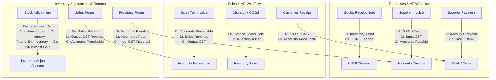

# Formalizing Production-Grade Operational Accounting Workflows

## Goal Description
Enhance the existing foundation in `App\Domains\Accounting` into a comprehensive, automated double-entry operational accounting system. This plan formalizes postings across the complete business lifecycle: Purchases, Sales, Inventory GRN, Returns (Purchase/Sales Returns), Stock Adjustments, and Operational Expenses.

---

## Technical Architecture & Operational Workflows



---

## User Review Required

> [!IMPORTANT]
> - All double-entry postings are automatically tenant-scoped by `organization_id` and assigned to the active `financial_year_id`.
> - If default General Ledger accounts (e.g. `COGS-01`, `GRNI-01`, `ADJ-EXP-01`) do not yet exist for an organization, `PostingService` automatically initializes them under standard Account Groups (`ASSET`, `LIABILITY`, `EXPENSE`, `REVENUE`, `EQUITY`).

---

## Proposed Changes

### Accounting Domain (`app/Domains/Accounting/Services`)

#### [MODIFY] [PostingService.php](file:///home/ecourt/my_projects/sanitarywares-and-tiles-erp/app/Domains/Accounting/Services/PostingService.php)
- Add complete workflow posting methods:
  - `postPurchaseInvoice()`: Handles supplier invoice posting against GRNI / Accounts Payable with Input GST.
  - `postCOGS()`: Posts Cost of Goods Sold upon sales invoice/dispatch (`Dr. COGS A/c -> Cr. Inventory Asset A/c`).
  - `postPurchaseReturn()`: Posts Debit Notes for vendor returns.
  - `postSalesReturn()`: Posts Credit Notes for customer returns.
  - `postInventoryAdjustment()`: Posts physical stock loss/damage or found extra stock to Inventory Adjustment Accounts.
  - `postExpenseVoucher()`: Posts direct operational expense payments or vendor bills.
- Add helper method `resolveOrCreateAccount()` for standard default system accounts (`COGS-01`, `GRNI-01`, `ADJ-EXP-01`, `ADJ-GAIN-01`, `SRET-01`, `PRET-01`).

---

### Inventory Domain (`app/Domains/Inventory/Services`)

#### [MODIFY] [InventoryService.php](file:///home/ecourt/my_projects/sanitarywares-and-tiles-erp/app/Domains/Inventory/Services/InventoryService.php)
- Integrate automatic accounting posting in `postStockAdjustment()`:
  - Trigger `PostingService::postInventoryAdjustment()` when a stock adjustment is approved.

---

### Sales Domain (`app/Domains/Sales/Services`)

#### [MODIFY] [SalesService.php](file:///home/ecourt/my_projects/sanitarywares-and-tiles-erp/app/Domains/Sales/Services/SalesService.php)
- Integrate COGS double-entry posting (`postCOGS()`) alongside revenue posting upon Tax Invoice creation.

---

### Tests

#### [NEW] [OperationalAccountingWorkflowTest.php](file:///home/ecourt/my_projects/sanitarywares-and-tiles-erp/tests/Feature/OperationalAccountingWorkflowTest.php)
- Test end-to-end accounting double-entry journal postings for:
  1. GRN Receipt & Supplier Invoice AP Posting
  2. Sales Invoice AR & COGS Posting
  3. Supplier Payment & Customer Receipt Postings
  4. Inventory Adjustment Loss & Gain Postings
  5. Purchase Return & Sales Return Postings

---

## Verification Plan

### Automated Tests
- Run PHPUnit test suite:
  ```bash
  ./vendor/bin/phpunit tests/Feature/OperationalAccountingWorkflowTest.php
  ./vendor/bin/phpunit
  ```

### Manual Verification
- Verify GL account balances (Balance Sheet, Profit & Loss, Trial Balance) reflect proper double-entry balance after simulated operational transactions.
