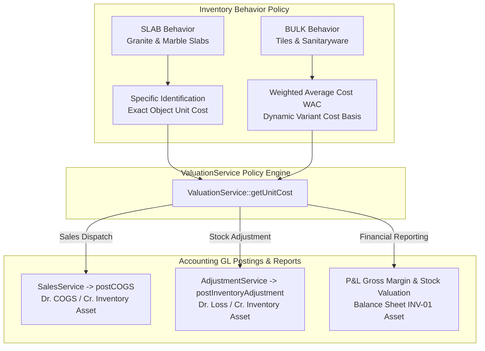

# Inventory Valuation Business Policy & Accounting Integration Plan

## Goal Description
Establish a binding, authoritative **Inventory Valuation Business Policy** that tightly connects physical stock movements (`InventoryObject`, `InventoryMovement`, `GRN`) directly to financial accounting (`PostingService`, `COGS`, `Inventory Asset GL`).

The valuation policy rules are enforced as core business domain logic:
1. **Specific Identification Method**: Applied to **Granite / Marble Slabs** (`SLAB` behavior). Each individual slab object maintains its exact specific purchase cost / cost price.
2. **Weighted Average Cost (WAC) Method**: Applied to **Bulk Items** (ordinary tiles, sanitaryware - `BULK` behavior). Unit cost is calculated dynamically based on total available stock value divided by total quantity, or updated from latest purchase GRNs / commercial pricings.

This policy will directly drive:
- **Cost of Goods Sold (COGS)** calculation during sales invoice / dispatch (`SalesService`).
- **Inventory Adjustment Valuation** during stock damage / loss or found stock approvals (`AdjustmentService`).
- **Stock Valuation Reports & Financial Statements** (Balance Sheet Inventory Asset `INV-01`, P&L Gross Margin / Product Profitability).

---

## Technical Architecture & Policy Definition



---

## User Review Required

> [!IMPORTANT]
> - **Slab Specific Identification**: Each slab object (`InventoryObject` with `behavior === 'SLAB'`) uses its exact unit cost (derived from GRN / slab receipt item cost or specific pricing).
> - **Bulk Weighted Average Cost (WAC)**: Bulk tiles/sanitaryware calculate unit cost via `ValuationService::getUnitCost()`, resolving weighted average cost from active inventory objects, GRNs, or commercial pricings.
> - **Unified Accounting Link**: Both `SalesService` (COGS posting) and `AdjustmentService` (inventory adjustment posting) will consume `ValuationService::getUnitCost()` to ensure 100% accounting alignment.

---

## Proposed Changes

### Inventory Domain (`app/Domains/Inventory/Services`)

#### [MODIFY] [ValuationService.php](file:///home/ecourt/my_projects/sanitarywares-and-tiles-erp/app/Domains/Inventory/Services/ValuationService.php)
- Implement authoritative policy-driven valuation resolution methods:
  - `getUnitCost(Product $variant, ?InventoryObject $object = null): float`: Resolves exact unit cost based on product behavior (`SLAB` $\rightarrow$ Specific Identification, `BULK` $\rightarrow$ Weighted Average Cost).
  - `calculateVariantWAC(int $organizationId, int $variantId): float`: Computes Weighted Average Cost from active inventory objects & purchase receipt history.
  - `calculateTotalInventoryValuation(int $organizationId, ?int $warehouseId = null): array`: Generates full inventory asset valuation trace per warehouse/category/behavior for financial reporting.

---

### Sales Domain (`app/Domains/Sales/Services`)

#### [MODIFY] [SalesService.php](file:///home/ecourt/my_projects/sanitarywares-and-tiles-erp/app/Domains/Sales/Services/SalesService.php)
- Connect COGS calculation directly to `ValuationService::getUnitCost()` for each sold item/slab during invoice generation.

---

### Inventory Adjustments (`app/Domains/Inventory/Services`)

#### [MODIFY] [AdjustmentService.php](file:///home/ecourt/my_projects/sanitarywares-and-tiles-erp/app/Domains/Inventory/Services/AdjustmentService.php)
- Update stock adjustment valuation to use `ValuationService::getUnitCost()` for precise loss/gain GL postings.

---

### Tests

#### [NEW] [InventoryAccountingValuationTest.php](file:///home/ecourt/my_projects/sanitarywares-and-tiles-erp/tests/Feature/InventoryAccountingValuationTest.php)
- Add feature tests validating:
  1. Specific Identification cost resolution for SLAB items.
  2. Weighted Average Cost (WAC) resolution for BULK tile items.
  3. COGS journal entry accuracy matching valuation policy on sales.
  4. Inventory Adjustment loss/gain GL entry valuation accuracy.

---

## Verification Plan

### Automated Tests
- Run PHPUnit tests:
  ```bash
  ./vendor/bin/phpunit tests/Feature/InventoryAccountingValuationTest.php
  ./vendor/bin/phpunit
  ```

### Manual Verification
- Verify that P&L Gross Margin and Balance Sheet Inventory Asset values match exact inventory valuation trace calculations.
